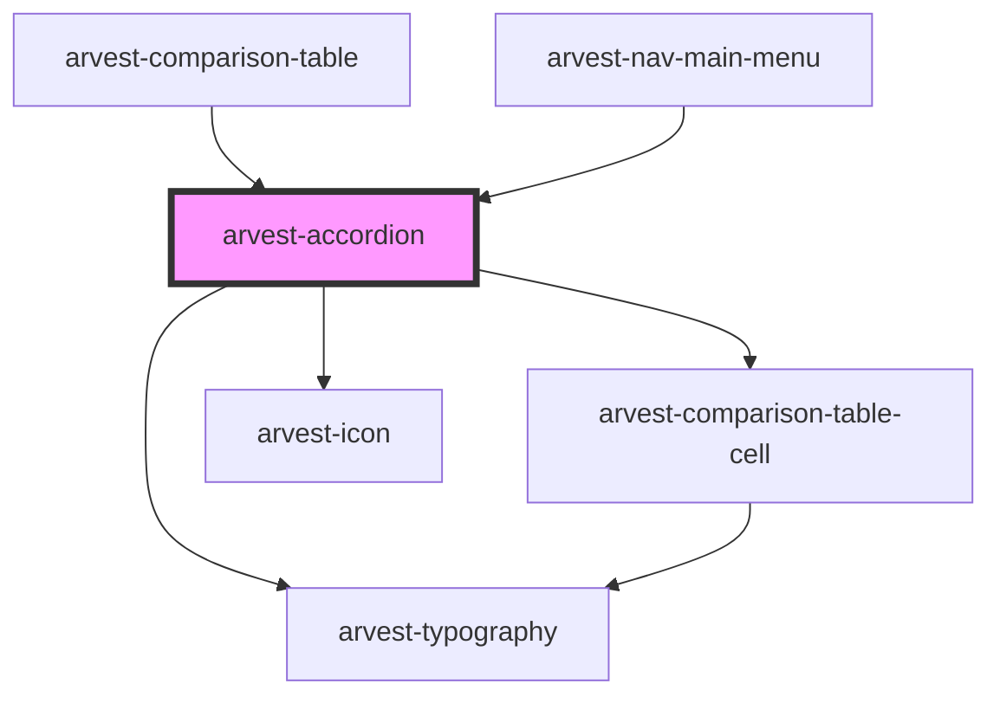

# arvest-accordion

<!-- Auto Generated Below -->

## Properties

| Property         | Attribute        | Description                                                                   | Type      | Default     |
| ---------------- | ---------------- | ----------------------------------------------------------------------------- | --------- | ----------- |
| `accordiontitle` | `accordiontitle` | Accordion title                                                               | `string`  | `undefined` |
| `activeCol`      | `active-col`     |                                                                               | `number`  | `0`         |
| `cols`           | --               | 2D Array of columns and cells                                                 | `any[][]` | `undefined` |
| `rowtitles`      | --               | Array of row titles                                                           | `any[]`   | `undefined` |
| `type`           | `type`           | Accordion type. Options are 'content', 'table-simple', 'nav', and 'mobileNav' | `string`  | `undefined` |

## Dependencies

### Used by

 - [arvest-comparison-table](../arvest-comparison-table)
 - [arvest-nav-main-menu](../arvest-nav-main-menu)

### Depends on

- [arvest-typography](../arvest-typography)
- [arvest-comparison-table-cell](../arvest-comparison-table-cell)
- [arvest-icon](../arvest-icon)

### Graph

----------------------------------------------

All components ©2021 Arvest. All rights reserved.
