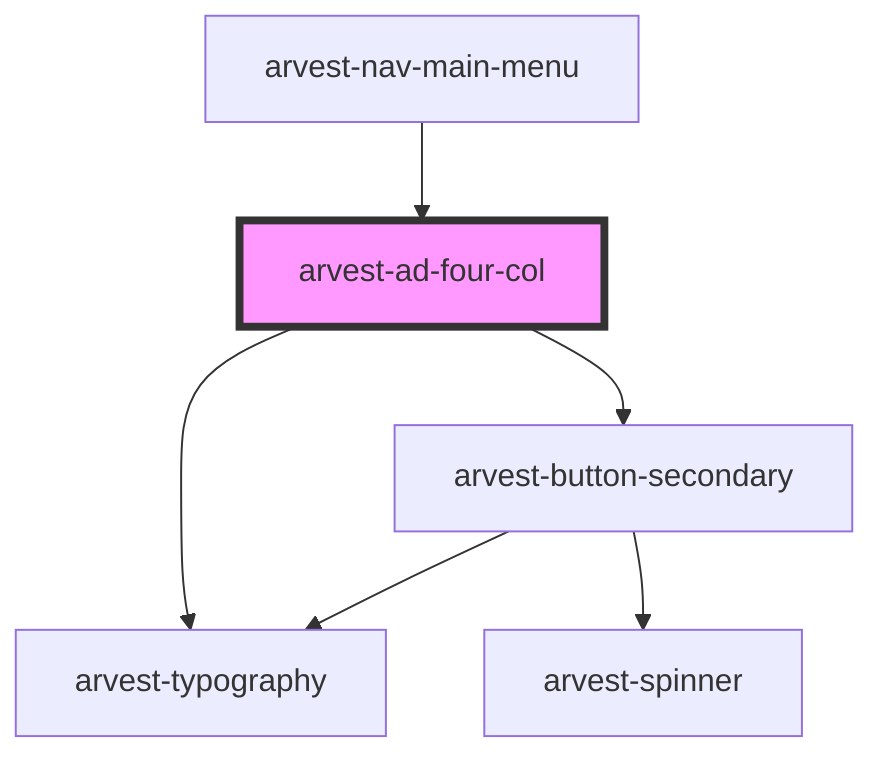

# arvest-ad-four-col

<!-- Auto Generated Below -->

## Properties

| Property    | Attribute   | Description                                                                                                                                                                                        | Type      | Default                        |
| ----------- | ----------- | -------------------------------------------------------------------------------------------------------------------------------------------------------------------------------------------------- | --------- | ------------------------------ |
| `bgimage`   | `bgimage`   | Change the background image using bgimage and a full URL as a string. Example: <arvest-ad-four-col bgimage="https://www.arvest.com/someimage.jpg">  The default background is a geometric pattern. | `string`  | `this.defaultbg`               |
| `color`     | `color`     | Change the background color. Color options: cobalt, ocean, navy. Default is cobalt.                                                                                                                | `string`  | `'cobalt'`                     |
| `ctatitle`  | `ctatitle`  | CTA / Button text                                                                                                                                                                                  | `string`  | `'Button'`                     |
| `defaultbg` | `defaultbg` |                                                                                                                                                                                                    | `string`  | `'/assets/images/pattern.svg'` |
| `opacity`   | `opacity`   | Change the opacity of the background image. Use a decimal between 0-1. Default value is 0.5 (50%). [optional]                                                                                      | `string`  | `'0.5'`                        |
| `showcta`   | `showcta`   | Turn the CTA on/off                                                                                                                                                                                | `boolean` | `true`                         |
| `size`      | `size`      | Optional sizes are small and large                                                                                                                                                                 | `string`  | `''`                           |
| `url`       | `url`       | CTA / Button URL                                                                                                                                                                                   | `string`  | `'https://www.arvest.com'`     |

## Dependencies

### Used by

 - [arvest-nav-main-menu](../arvest-nav-main-menu)

### Depends on

- [arvest-typography](../arvest-typography)
- [arvest-button-secondary](../arvest-button-secondary)

### Graph

----------------------------------------------

All components ©2021 Arvest. All rights reserved.
