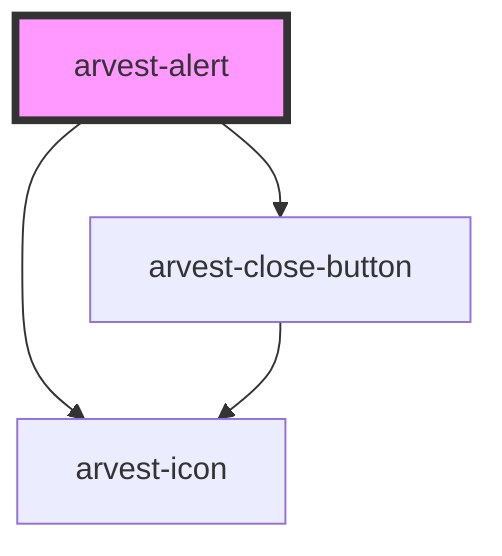

# arvest-alert

<!-- Auto Generated Below -->

## Properties

| Property    | Attribute   | Description                                                                                                                                                                   | Type      | Default     |
| ----------- | ----------- | ----------------------------------------------------------------------------------------------------------------------------------------------------------------------------- | --------- | ----------- |
| `banner`    | `banner`    | Banner: passing this as true will display the alert as a banner at the top of the page                                                                                        | `boolean` | `false`     |
| `dismissed` | `dismissed` | Dismissed                                                                                                                                                                     | `boolean` | `false`     |
| `type`      | `type`      | Options for the Alert component The types of available alerts are default, alert, confirmation, caution and info. The styles and icons are tied to that selection. [Required] | `string`  | `undefined` |

## Dependencies

### Depends on

- [arvest-icon](../arvest-icon)
- [arvest-close-button](../arvest-close-button)

### Graph

----------------------------------------------

All components ©2021 Arvest. All rights reserved.
