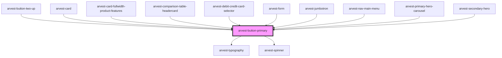

# arvest-button-primary

<!-- Auto Generated Below -->

## Properties

| Property    | Attribute   | Description                                                             | Type                                                         | Default     |
| ----------- | ----------- | ----------------------------------------------------------------------- | ------------------------------------------------------------ | ----------- |
| `disabled`  | `disabled`  | If true, disable mouse events                                           | `boolean`                                                    | `undefined` |
| `isloading` | `isloading` | If true, spinner for loading                                            | `boolean`                                                    | `undefined` |
| `issmall`   | `issmall`   | If true, button size will be smaller                                    | `boolean`                                                    | `undefined` |
| `label`     | `label`     | Text inside the button. Must not be more than 25 characters. [Required] | `string`                                                     | `'Button'`  |
| `type`      | `type`      | Change the type of the component using the ButtonType enum              | `ButtonType.button \| ButtonType.reset \| ButtonType.submit` | `undefined` |
| `width`     | `width`     | Custom button width                                                     | `number`                                                     | `undefined` |

## Shadow Parts

| Part           | Description |
| -------------- | ----------- |
| `"btn-custom"` |             |

## Dependencies

### Used by

 - [arvest-button-two-up](../arvest-button-two-up)
 - [arvest-card](../arvest-card)
 - [arvest-card-fullwidth-product-features](../arvest-card-fullwidth-product-features)
 - [arvest-comparison-table-headercard](../arvest-comparison-table-headercard)
 - [arvest-debit-credit-card-selector](../arvest-debit-credit-card-selector)
 - [arvest-form](../arvest-form)
 - [arvest-jumbotron](../arvest-jumbotron)
 - [arvest-nav-main-menu](../arvest-nav-main-menu)
 - [arvest-primary-hero-carousel](../arvest-primary-hero-carousel)
 - [arvest-secondary-hero](../arvest-secondary-hero)

### Depends on

- [arvest-typography](../arvest-typography)
- [arvest-spinner](../arvest-spinner)

### Graph

----------------------------------------------

All components ©2021 Arvest. All rights reserved.
