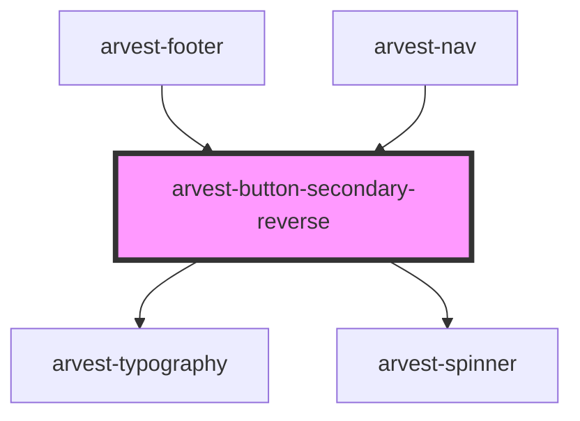

# arvest-button-secondary-reverse

<!-- Auto Generated Below -->

## Properties

| Property    | Attribute   | Description                                                | Type                                                         | Default     |
| ----------- | ----------- | ---------------------------------------------------------- | ------------------------------------------------------------ | ----------- |
| `disabled`  | `disabled`  | If true, disable mouse events                              | `boolean`                                                    | `undefined` |
| `isloading` | `isloading` | If true, spinner for loading                               | `boolean`                                                    | `undefined` |
| `issmall`   | `issmall`   | If true, button size will be smaller                       | `boolean`                                                    | `undefined` |
| `label`     | `label`     | Text inside the button [Required]                          | `string`                                                     | `'Button'`  |
| `type`      | `type`      | Change the type of the component using the ButtonType enum | `ButtonType.button \| ButtonType.reset \| ButtonType.submit` | `undefined` |

## Shadow Parts

| Part           | Description |
| -------------- | ----------- |
| `"btn-custom"` |             |

## Dependencies

### Used by

 - [arvest-footer](../arvest-footer)
 - [arvest-nav](../arvest-nav)

### Depends on

- [arvest-typography](../arvest-typography)
- [arvest-spinner](../arvest-spinner)

### Graph

----------------------------------------------

All components ©2021 Arvest. All rights reserved.
