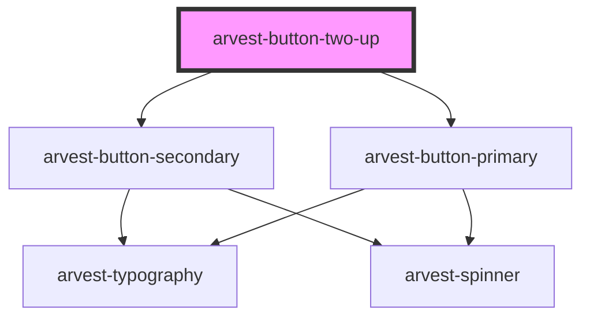

# arvest-button-two-up

<!-- Auto Generated Below -->

## Properties

| Property         | Attribute         | Description                  | Type      | Default     |
| ---------------- | ----------------- | ---------------------------- | --------- | ----------- |
| `isSmall`        | `is-small`        | Use small button variant?  * | `boolean` | `false`     |
| `primaryTitle`   | `primary-title`   | Primary button title.  *     | `string`  | `undefined` |
| `primaryUrl`     | `primary-url`     | Primary button url.  *       | `string`  | `undefined` |
| `secondaryTitle` | `secondary-title` | Secondary button title.  *   | `string`  | `undefined` |
| `secondaryUrl`   | `secondary-url`   | Secondary button url.  *     | `string`  | `undefined` |

## Events

| Event            | Description                                   | Type                      |
| ---------------- | --------------------------------------------- | ------------------------- |
| `clickPrimary`   | Emit event when primary button is clicked *   | `CustomEvent<MouseEvent>` |
| `clickSecondary` | Emit event when secondary button is clicked * | `CustomEvent<MouseEvent>` |

## Dependencies

### Depends on

- [arvest-button-secondary](../arvest-button-secondary)
- [arvest-button-primary](../arvest-button-primary)

### Graph

----------------------------------------------

All components ©2021 Arvest. All rights reserved.
