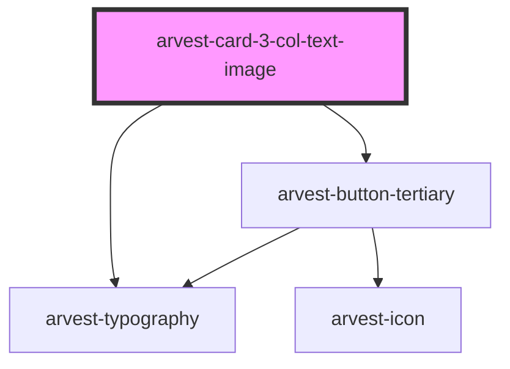

# arvest-card-3-col-text-image

<!-- Auto Generated Below -->

## Properties

| Property       | Attribute      | Description                          | Type     | Default                                                                       |
| -------------- | -------------- | ------------------------------------ | -------- | ----------------------------------------------------------------------------- |
| `altfour`      | `altfour`      | Card four image alt text [Required]  | `string` | `'This is an image'`                                                          |
| `altone`       | `altone`       | Card one image alt text [Required]   | `string` | `'This is an image'`                                                          |
| `altthree`     | `altthree`     | Card three image alt text [Required] | `string` | `'This is an image'`                                                          |
| `alttwo`       | `alttwo`       | Card two image alt text [Required]   | `string` | `'This is an image'`                                                          |
| `bodyfour`     | `bodyfour`     | Card four body text [Required]       | `string` | `'Lorem ipsum dolor sit amet, elit ut, purus sit amet luctus vene natis ...'` |
| `bodyone`      | `bodyone`      | Card one body text [Required]        | `string` | `'Lorem ipsum dolor sit amet, elit ut, purus sit amet luctus vene natis ...'` |
| `bodythree`    | `bodythree`    | Card three body text [Required]      | `string` | `'Lorem ipsum dolor sit amet, elit ut, purus sit amet luctus vene natis ...'` |
| `bodytwo`      | `bodytwo`      | Card two body text [Required]        | `string` | `'Lorem ipsum dolor sit amet, elit ut, purus sit amet luctus vene natis ...'` |
| `ctalabel`     | `ctalabel`     | Label for the CTA                    | `string` | `'Read more'`                                                                 |
| `ctalink`      | `ctalink`      | CTA Link [Required]                  | `string` | `'#'`                                                                         |
| `imagefour`    | `imagefour`    | Card four image URL [Required]       | `string` | `'https://www.arvest.com/images/dls/500x315/1.jpg'`                           |
| `imageone`     | `imageone`     | Card one image URL [Required]        | `string` | `'https://www.arvest.com/images/dls/500x315/1.jpg'`                           |
| `imagethree`   | `imagethree`   | Card three image URL [Required]      | `string` | `'https://www.arvest.com/images/dls/500x315/1.jpg'`                           |
| `imagetwo`     | `imagetwo`     | Card two image URL [Required]        | `string` | `'https://www.arvest.com/images/dls/500x315/1.jpg'`                           |
| `linkfour`     | `linkfour`     | Card four link URL                   | `string` | `'#'`                                                                         |
| `linkone`      | `linkone`      | Card one link URL                    | `string` | `'#'`                                                                         |
| `linkthree`    | `linkthree`    | Card three link URL                  | `string` | `'#'`                                                                         |
| `linktwo`      | `linktwo`      | Card two link URL                    | `string` | `'#'`                                                                         |
| `mainheadline` | `mainheadline` | Main headline for the component      | `string` | `'News and stories'`                                                          |
| `titlefour`    | `titlefour`    | Card four title [Required]           | `string` | `'Title four'`                                                                |
| `titleone`     | `titleone`     | Card one title [Required]            | `string` | `'Title one'`                                                                 |
| `titlethree`   | `titlethree`   | Card three title [Required]          | `string` | `'Title three'`                                                               |
| `titletwo`     | `titletwo`     | Card two title [Required]            | `string` | `'Title two'`                                                                 |

## Dependencies

### Depends on

- [arvest-typography](../arvest-typography)
- [arvest-button-tertiary](../arvest-button-tertiary)

### Graph

----------------------------------------------

All components ©2021 Arvest. All rights reserved.
