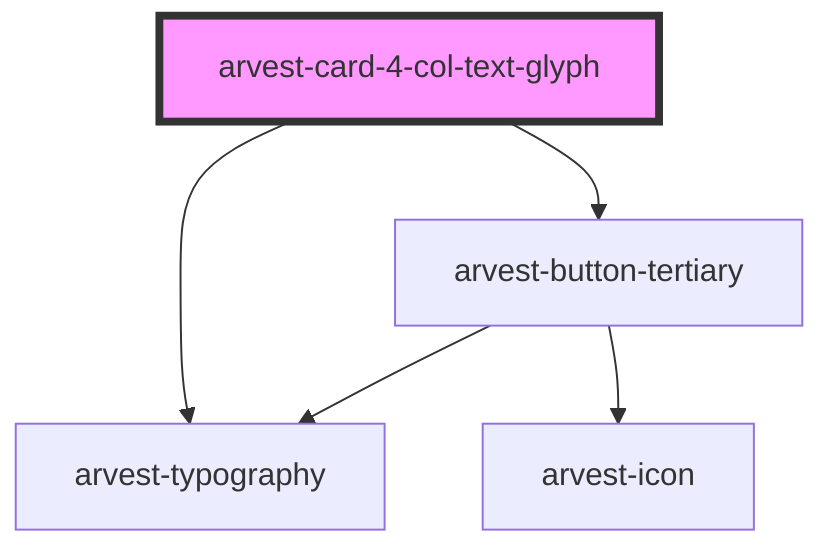

# arvest-card-4-col-text-glyph

<!-- Auto Generated Below -->

## Properties

| Property       | Attribute      | Description                          | Type     | Default                                                                   |
| -------------- | -------------- | ------------------------------------ | -------- | ------------------------------------------------------------------------- |
| `altone`       | `altone`       | Card one glyph alt text [Required]   | `string` | `'This icon needs a description'`                                         |
| `altthree`     | `altthree`     | Card three glyph alt text [Required] | `string` | `'This icon needs a description'`                                         |
| `alttwo`       | `alttwo`       | Card two glyph alt text [Required]   | `string` | `'This icon needs a description'`                                         |
| `bodyone`      | `bodyone`      | Card one body text [Required]        | `string` | `'Lorem ipsum dolor sit amet, elit ut, purus sit amet luctus vene natis'` |
| `bodythree`    | `bodythree`    | Card three body text [Required]      | `string` | `'Lorem ipsum dolor sit amet, elit ut, purus sit amet luctus vene natis'` |
| `bodytwo`      | `bodytwo`      | Card two body text [Required]        | `string` | `'Lorem ipsum dolor sit amet, elit ut, purus sit amet luctus vene natis'` |
| `linkone`      | `linkone`      | Card one link URL                    | `string` | `'#'`                                                                     |
| `linkthree`    | `linkthree`    | Card three link URL                  | `string` | `'#'`                                                                     |
| `linktwo`      | `linktwo`      | Card two link URL                    | `string` | `'#'`                                                                     |
| `mainheadline` | `mainheadline` | Main headline for the component      | `string` | `'Helpful resources'`                                                     |
| `titleone`     | `titleone`     | Card one title [Required]            | `string` | `'Title one'`                                                             |
| `titlethree`   | `titlethree`   | Card three title [Required]          | `string` | `'Title three'`                                                           |
| `titletwo`     | `titletwo`     | Card two title [Required]            | `string` | `'Title two'`                                                             |

## Dependencies

### Depends on

- [arvest-typography](../arvest-typography)
- [arvest-button-tertiary](../arvest-button-tertiary)

### Graph

----------------------------------------------

All components ©2021 Arvest. All rights reserved.
