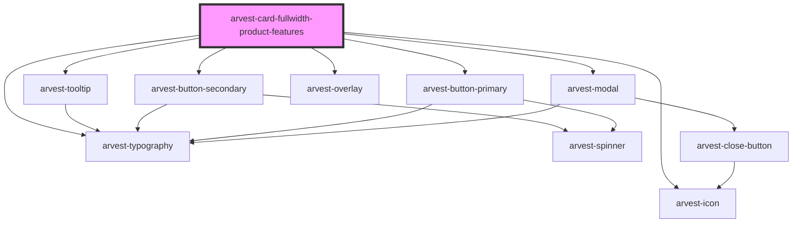

# arvest-card-fullwidth-cta-icon

<!-- Auto Generated Below -->

## Properties

| Property            | Attribute             | Description                                                    | Type     | Default                            |
| ------------------- | --------------------- | -------------------------------------------------------------- | -------- | ---------------------------------- |
| `cardTitle`         | `card-title`          | Main title for the component                                   | `string` | `undefined`                        |
| `description`       | `description`         | Description text                                               | `string` | `undefined`                        |
| `iconTips`          | `icon-tips`           | Icon links, in same order as icons (pipe separated, no spaces) | `string` | `undefined`                        |
| `icons`             | `icons`               | Icon names to be displayed (pipe separated, no spaces)         | `string` | `undefined`                        |
| `identifier`        | `identifier`          | ID component                                                   | `string` | `'arvest-fullwidth-card-cta-icon'` |
| `listDescription`   | `list-description`    | Optional list dscription text                                  | `string` | `undefined`                        |
| `listItems`         | `list-items`          | List items to be displayed (pipe separated, no spaces)         | `string` | `undefined`                        |
| `primaryCtaTitle`   | `primary-cta-title`   | Primary CTA title                                              | `string` | `undefined`                        |
| `primaryCtaUrl`     | `primary-cta-url`     | Primary CTA URL                                                | `string` | `undefined`                        |
| `secondaryCtaTitle` | `secondary-cta-title` | Secondary CTA title                                            | `string` | `undefined`                        |
| `secondaryCtaUrl`   | `secondary-cta-url`   | Secondary CTA URL                                              | `string` | `undefined`                        |

## Dependencies

### Depends on

- [arvest-typography](../arvest-typography)
- [arvest-icon](../arvest-icon)
- [arvest-tooltip](../arvest-tooltip)
- [arvest-button-secondary](../arvest-button-secondary)
- [arvest-button-primary](../arvest-button-primary)
- [arvest-overlay](../arvest-overlay)
- [arvest-modal](../arvest-modal)

### Graph

----------------------------------------------

All components ©2021 Arvest. All rights reserved.
