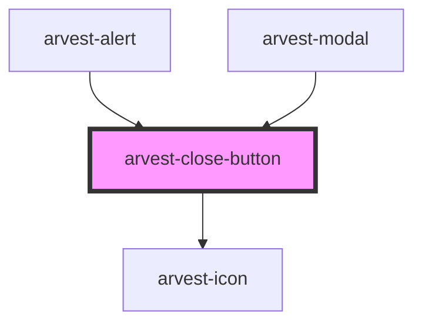

# arvest-close-button

<!-- Auto Generated Below -->

## Properties

| Property | Attribute | Description | Type     | Default   |
| -------- | --------- | ----------- | -------- | --------- |
| `label`  | `label`   |             | `string` | `'Close'` |

## Dependencies

### Used by

 - [arvest-alert](../arvest-alert)
 - [arvest-modal](../arvest-modal)

### Depends on

- [arvest-icon](../arvest-icon)

### Graph

----------------------------------------------

All components ©2021 Arvest. All rights reserved.
