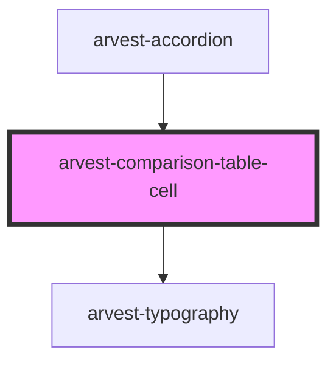

# arvest-comparison-table-cell

<!-- Auto Generated Below -->

## Properties

| Property  | Attribute | Description | Type                                                                                                                                           | Default     |
| --------- | --------- | ----------- | ---------------------------------------------------------------------------------------------------------------------------------------------- | ----------- |
| `data`    | `data`    |             | `any[] \| string`                                                                                                                              | `undefined` |
| `variant` | `variant` |             | `CellVariant.bulletList \| CellVariant.checkmark \| CellVariant.dash \| CellVariant.na \| CellVariant.nonBulletList \| CellVariant.singleText` | `undefined` |

## Dependencies

### Used by

 - [arvest-accordion](../arvest-accordion)

### Depends on

- [arvest-typography](../arvest-typography)

### Graph

----------------------------------------------

All components ©2021 Arvest. All rights reserved.
