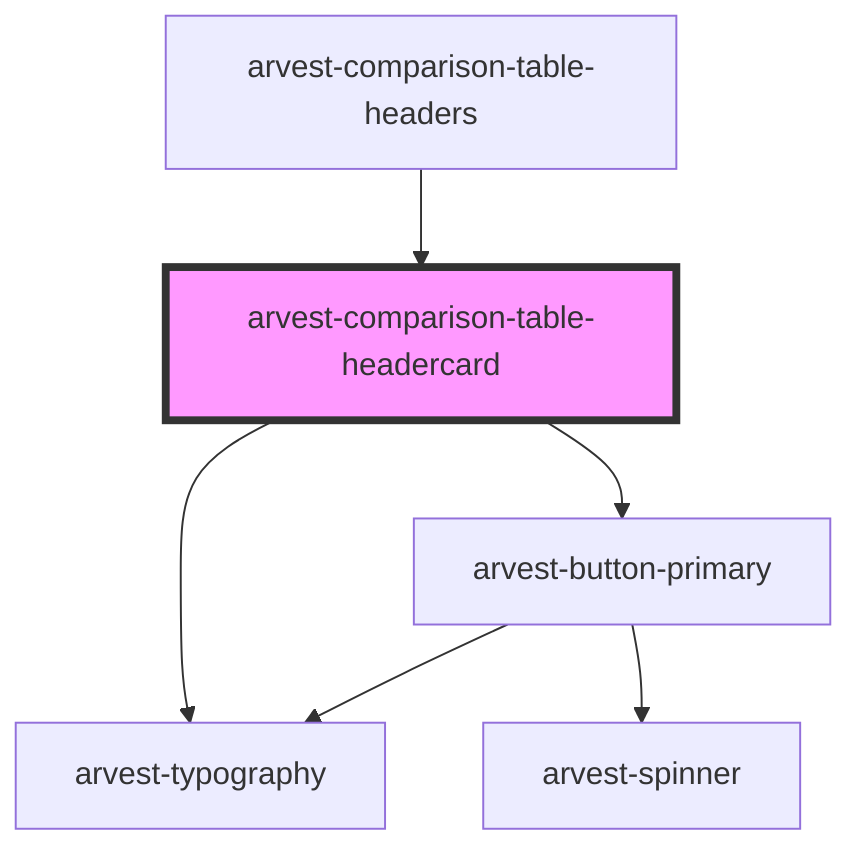

# arvest-comparison-table-headercard

<!-- Auto Generated Below -->

## Properties

| Property      | Attribute     | Description | Type      | Default     |
| ------------- | ------------- | ----------- | --------- | ----------- |
| `cardTitle`   | `card-title`  |             | `string`  | `undefined` |
| `cta`         | `cta`         |             | `string`  | `undefined` |
| `description` | `description` |             | `string`  | `undefined` |
| `hascolor`    | `hascolor`    |             | `boolean` | `undefined` |

## Dependencies

### Used by

 - [arvest-comparison-table-headers](../arvest-comparison-table-headers)

### Depends on

- [arvest-typography](../arvest-typography)
- [arvest-button-primary](../arvest-button-primary)

### Graph

----------------------------------------------

All components ©2021 Arvest. All rights reserved.
