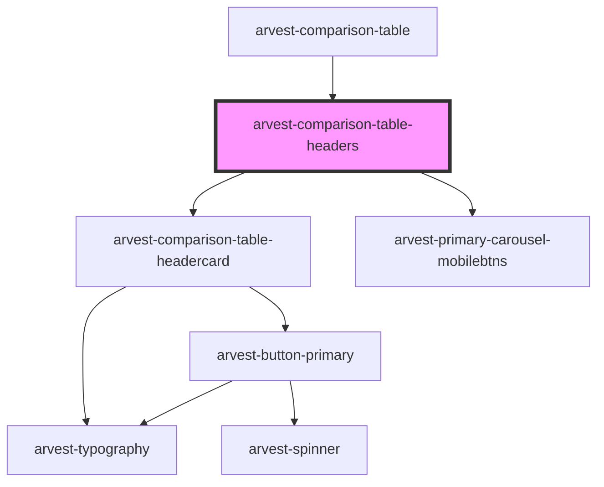

# arvest-comparison-table-headers

<!-- Auto Generated Below -->

## Properties

| Property  | Attribute | Description | Type    | Default     |
| --------- | --------- | ----------- | ------- | ----------- |
| `headers` | --        |             | `any[]` | `undefined` |

## Events

| Event         | Description | Type                  |
| ------------- | ----------- | --------------------- |
| `slidermoved` |             | `CustomEvent<number>` |

## Dependencies

### Used by

 - [arvest-comparison-table](../arvest-comparison-table)

### Depends on

- [arvest-comparison-table-headercard](../arvest-comparison-table-headercard)
- [arvest-primary-carousel-mobilebtns](../arvest-primary-carousel-mobilebtns)

### Graph

----------------------------------------------

All components ©2021 Arvest. All rights reserved.
