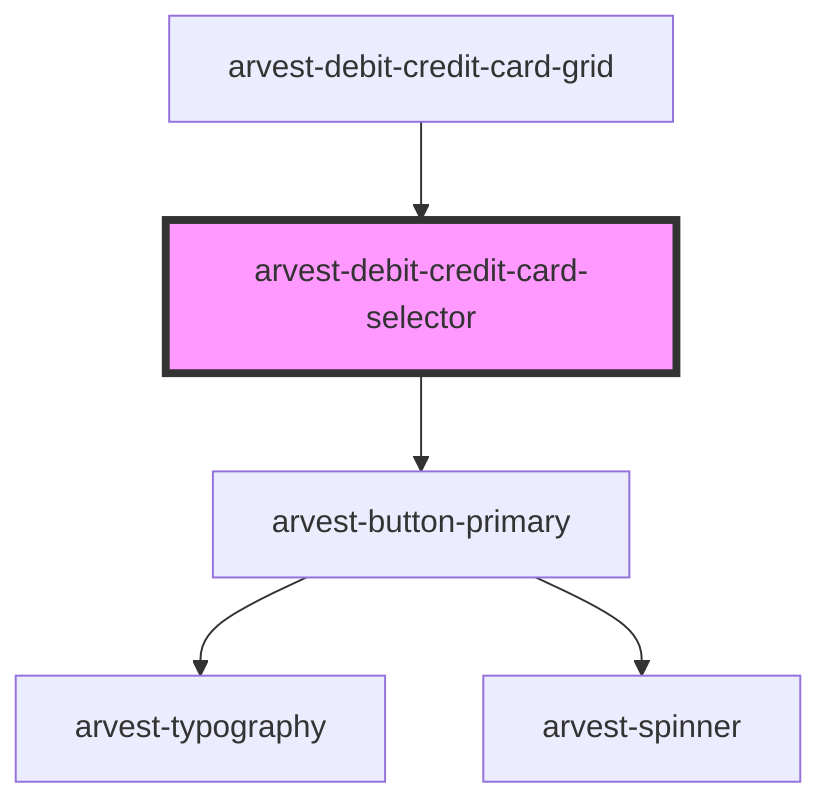

# arvest-category-card

<!-- Auto Generated Below -->

## Properties

| Property       | Attribute       | Description              | Type      | Default     |
| -------------- | --------------- | ------------------------ | --------- | ----------- |
| `bgimage`      | `bgimage`       | URL for background image | `string`  | `undefined` |
| `label`        | `label`         | Label text for card      | `string`  | `undefined` |
| `linkcta`      | `linkcta`       | Link CTA text            | `string`  | `undefined` |
| `selectButton` | `select-button` | Button CTA text          | `string`  | `'Select'`  |
| `showButton`   | `show-button`   | Turn Button on/off       | `boolean` | `undefined` |
| `showLabel`    | `show-label`    | Turn Label on/off        | `boolean` | `undefined` |
| `showLink`     | `show-link`     | Turn Link on/off         | `boolean` | `undefined` |

## Dependencies

### Used by

 - [arvest-debit-credit-card-grid](../arvest-debit-credit-card-grid)

### Depends on

- [arvest-button-primary](../arvest-button-primary)

### Graph

----------------------------------------------

All components ©2021 Arvest. All rights reserved.
