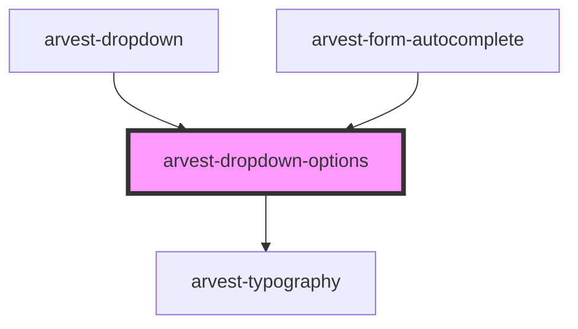

# arvest-dropdown-options

<!-- Auto Generated Below -->

## Properties

| Property        | Attribute        | Description                                                                         | Type      | Default                   |
| --------------- | ---------------- | ----------------------------------------------------------------------------------- | --------- | ------------------------- |
| `identifier`    | `identifier`     | Unique identifier.                                                                  | `string`  | `'arvestDropdownOptions'` |
| `open`          | `open`           | Set true to open options.                                                           | `boolean` | `false`                   |
| `options`       | `options`        | Dropdown options as a string '[{label: string, value: string, selected?: boolean}]' | `string`  | `undefined`               |
| `scrollEnabled` | `scroll-enabled` | Enable fixed-height, scrollable dropdown                                            | `boolean` | `true`                    |
| `width`         | `width`          | Set the width of the dropdown, can be any valid css value for the width property.   | `string`  | `'240px'`                 |

## Events

| Event                 | Description                                                                        | Type                                 |
| --------------------- | ---------------------------------------------------------------------------------- | ------------------------------------ |
| `dropdownSelectValue` | Emitted when a dropdown option is selected. Data payload contains selected option. | `CustomEvent<IFormDropdownOption>`   |
| `optionsUpdated`      | Emitted when options are changed. Data payload contains array of new options.      | `CustomEvent<IFormDropdownOption[]>` |

## Dependencies

### Used by

 - [arvest-dropdown](../arvest-dropdown)
 - [arvest-form-autocomplete](../arvest-form-autocomplete)

### Depends on

- [arvest-typography](../arvest-typography)

### Graph

----------------------------------------------

All components ©2021 Arvest. All rights reserved.
