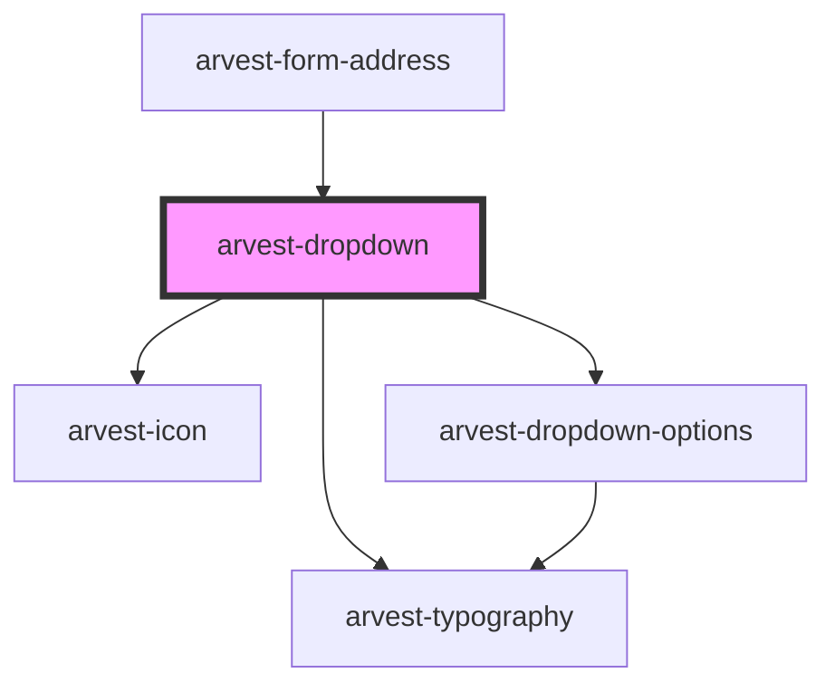

# arvest-dropdown

<!-- Auto Generated Below -->

## Properties

| Property        | Attribute        | Description                                                                         | Type      | Default            |
| --------------- | ---------------- | ----------------------------------------------------------------------------------- | --------- | ------------------ |
| `disabled`      | `disabled`       | Disable dropdown                                                                    | `string`  | `undefined`        |
| `identifier`    | `identifier`     | ID for the dropdown *                                                               | `string`  | `'arvestDropdown'` |
| `label`         | `label`          | Dropdown label text                                                                 | `string`  | `undefined`        |
| `options`       | `options`        | Dropdown options '[{label: string, value: string, selected?: boolean}]' *           | `string`  | `undefined`        |
| `scrollEnabled` | `scroll-enabled` | Enable fixed-height, scrollable dropdown *                                          | `boolean` | `true`             |
| `width`         | `width`          | Set the width of the dropdown. Can be any valid value for the width CSS property. * | `string`  | `'240px'`          |

## Events

| Event                 | Description                                                                                                             | Type                               |
| --------------------- | ----------------------------------------------------------------------------------------------------------------------- | ---------------------------------- |
| `dropdownSelectValue` | Event emitted when an options is chosen from the dropdown. Data payload is an object: { label: string, value: string }. | `CustomEvent<IFormDropdownOption>` |

## Dependencies

### Used by

 - [arvest-form-address](../arvest-form-address)

### Depends on

- [arvest-typography](../arvest-typography)
- [arvest-icon](../arvest-icon)
- [arvest-dropdown-options](../arvest-dropdown-options)

### Graph

----------------------------------------------

All components ©2021 Arvest. All rights reserved.
