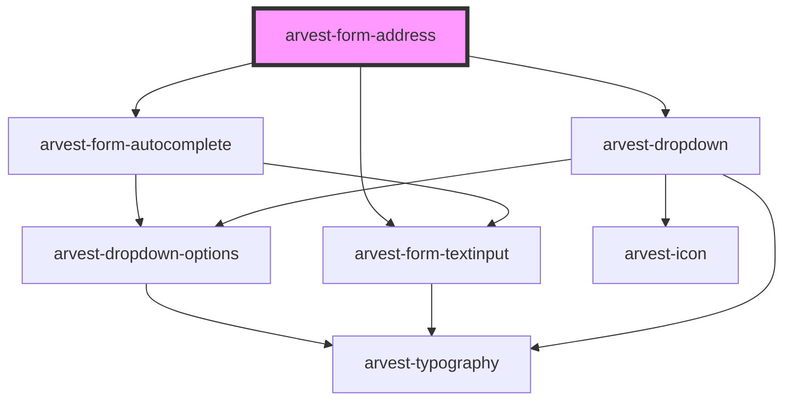

# arvest-form-address

<!-- Auto Generated Below -->

## Properties

| Property             | Attribute             | Description                                          | Type      | Default     |
| -------------------- | --------------------- | ---------------------------------------------------- | --------- | ----------- |
| `apiKey`             | `api-key`             | Google Maps API key.                                 | `string`  | `undefined` |
| `city`               | `city`                | Address city                                         | `string`  | `undefined` |
| `includeTerritories` | `include-territories` | Should we include US territories in the states list? | `boolean` | `undefined` |
| `stateAbbr`          | `state-abbr`          | Address state                                        | `string`  | `undefined` |
| `street`             | `street`              | Address street.                                      | `string`  | `undefined` |
| `unit`               | `unit`                | Address unit #                                       | `string`  | `undefined` |
| `zip`                | `zip`                 | Address zip code                                     | `string`  | `undefined` |

## Events

| Event           | Description                                                                                                                                                                                                                                                           | Type                |
| --------------- | --------------------------------------------------------------------------------------------------------------------------------------------------------------------------------------------------------------------------------------------------------------------- | ------------------- |
| `addressChange` | Event emitted when any value in the address fields change. Object in event details is formatted like:  { streetAddress: string \| undefined,   unit: string \| undefined,   city: string \| undefined,   stateAbbr: string \| undefined,   zip: string \| undefined } | `CustomEvent<any>`  |
| `googleReady`   | Event emitted when the Google Maps js library is set up and ready to use. Event contain no data payload.                                                                                                                                                              | `CustomEvent<void>` |

## Dependencies

### Depends on

- [arvest-form-autocomplete](../arvest-form-autocomplete)
- [arvest-form-textinput](../arvest-form-textinput)
- [arvest-dropdown](../arvest-dropdown)

### Graph

----------------------------------------------

All components ©2021 Arvest. All rights reserved.
