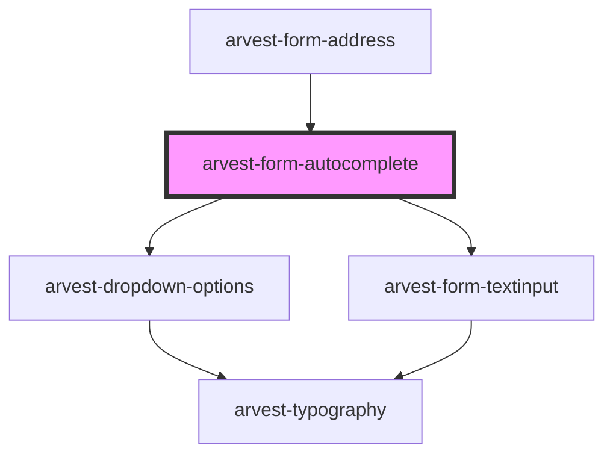

# arvest-form-autocomplete

<!-- Auto Generated Below -->

## Properties

| Property          | Attribute           | Description                                                                                                                                                                                                                                                                                                                                                      | Type      | Default     |
| ----------------- | ------------------- | ---------------------------------------------------------------------------------------------------------------------------------------------------------------------------------------------------------------------------------------------------------------------------------------------------------------------------------------------------------------- | --------- | ----------- |
| `ariaDescribedBy` | `aria-described-by` | The aria-describedby attribute is used to indicate the IDs of the elements that describe the object. It is used to establish a relationship between widgets or groups and text that described them. More info here: https://developer.mozilla.org/en-US/docs/Web/Accessibility/ARIA/ARIA_Techniques/Using_the_aria-describedby_attribute                         | `string`  | `undefined` |
| `ariaLabel`       | `aria-label`        | The aria-label attribute is used to define a string that labels the current element. Use it in cases where a text label is not visible on the screen. If there is visible text labeling the element, use aria-labelledby instead. More info here: https://developer.mozilla.org/en-US/docs/Web/Accessibility/ARIA/ARIA_Techniques/Using_the_aria-label_attribute | `string`  | `undefined` |
| `ariaRequired`    | `aria-required`     | The aria-required attribute provides assistive technologies information indicating if a field is required or not. [Required]  More info here: https://developer.mozilla.org/en-US/docs/Web/Accessibility/ARIA/ARIA_Techniques/Using_the_aria-required_attribute                                                                                                  | `boolean` | `undefined` |
| `autocomplete`    | `autocomplete`      | Use autocomplete to improve automated assistance and the use of password managers More info here: https://developer.mozilla.org/en-US/docs/Web/HTML/Attributes/autocomplete                                                                                                                                                                                      | `string`  | `'on'`      |
| `disabled`        | `disabled`          | Is it disabled?                                                                                                                                                                                                                                                                                                                                                  | `boolean` | `undefined` |
| `elemId`          | `elem-id`           | Give the Element a unique ID to match labels with form fields and enable functionality [Required]                                                                                                                                                                                                                                                                | `string`  | `undefined` |
| `label`           | `label`             | Label describes the input field for the user and for screenreaders [Required]                                                                                                                                                                                                                                                                                    | `string`  | `undefined` |
| `name`            | `name`              | Element name attribute.                                                                                                                                                                                                                                                                                                                                          | `string`  | `undefined` |
| `options`         | `options`           | Dropdown options '[{label: string, value: string, selected?: boolean}]'                                                                                                                                                                                                                                                                                          | `string`  | `undefined` |
| `placeholder`     | `placeholder`       | Placeholders are optional and have been visually hidden from the component so any text rendered will not have an effect. This prop has been left in the event the design changes in the future.                                                                                                                                                                  | `string`  | `undefined` |
| `required`        | `required`          | Is the form element required?                                                                                                                                                                                                                                                                                                                                    | `boolean` | `undefined` |
| `small`           | `small`             | True for small display.                                                                                                                                                                                                                                                                                                                                          | `string`  | `undefined` |
| `value`           | `value`             | Initial value for field.                                                                                                                                                                                                                                                                                                                                         | `string`  | `undefined` |

## Events

| Event                 | Description                                                                                                                            | Type                               |
| --------------------- | -------------------------------------------------------------------------------------------------------------------------------------- | ---------------------------------- |
| `dropdownSelectValue` | Event emitted when a value is selected from the options dropdown. Data payload contain option object.                                  | `CustomEvent<IFormDropdownOption>` |
| `optionsUpdated`      | Event emitted when the dropdown options are updated. Contains new options formatted as a string. Does not bubble outside of component. | `CustomEvent<string>`              |
| `textChange`          | Event emitted when the text changes in the text field portion of the autocomplete. Data payload contains text string.                  | `CustomEvent<string>`              |

## Dependencies

### Used by

 - [arvest-form-address](../arvest-form-address)

### Depends on

- [arvest-dropdown-options](../arvest-dropdown-options)
- [arvest-form-textinput](../arvest-form-textinput)

### Graph

----------------------------------------------

All components ©2021 Arvest. All rights reserved.
