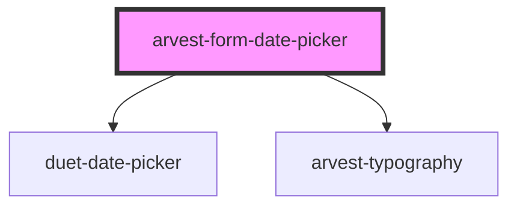

# arvest-form-datepicker

<!-- Auto Generated Below -->

## Properties

| Property      | Attribute     | Description                                     | Type      | Default                                  |
| ------------- | ------------- | ----------------------------------------------- | --------- | ---------------------------------------- |
| `disabled`    | `disabled`    | Is the input element disabled?                  | `boolean` | `false`                                  |
| `identifier`  | `identifier`  | Component id                                    | `string`  | `'arvest-date-picker'`                   |
| `label`       | `label`       | Define the label for the component              | `string`  | `'Choose a date'`                        |
| `max`         | `max`         | Maximum date available to pick (ex. 1900-01-01) | `string`  | `new Date().toISOString().split('T')[0]` |
| `min`         | `min`         | Minimum date available to pick (ex. 1900-01-01) | `string`  | `'1900-01-01'`                           |
| `name`        | `name`        | Name for the input element                      | `string`  | `'arvest-date-picker'`                   |
| `placeholder` | `placeholder` | Define the placeholder value for the input      | `string`  | `'mm/dd/yyyy'`                           |
| `required`    | `required`    | Is the input element required?                  | `boolean` | `false`                                  |
| `role`        | `role`        | Assign a role to the component                  | `string`  | `undefined`                              |
| `value`       | `value`       | Element value (ex. 1900-01-01)                  | `string`  | `undefined`                              |

## Events

| Event              | Description                                                | Type                            |
| ------------------ | ---------------------------------------------------------- | ------------------------------- |
| `datePickerBlur`   | Event emitted when the user leaves the date picker.        | `CustomEvent<CustomEvent<any>>` |
| `datePickerChange` | Event emitted when the date picker date changes.           | `CustomEvent<CustomEvent<any>>` |
| `datePickerClose`  | Event emitted when calendar display of date picker closes. | `CustomEvent<CustomEvent<any>>` |
| `datePickerFocus`  | Event emitted when the user focuses into the date picker.  | `CustomEvent<CustomEvent<any>>` |
| `datePickerOpen`   | Event emitted when calendar display of date picker opens.  | `CustomEvent<CustomEvent<any>>` |

## Dependencies

### Depends on

- duet-date-picker
- [arvest-typography](../arvest-typography)

### Graph

----------------------------------------------

All components ©2021 Arvest. All rights reserved.
