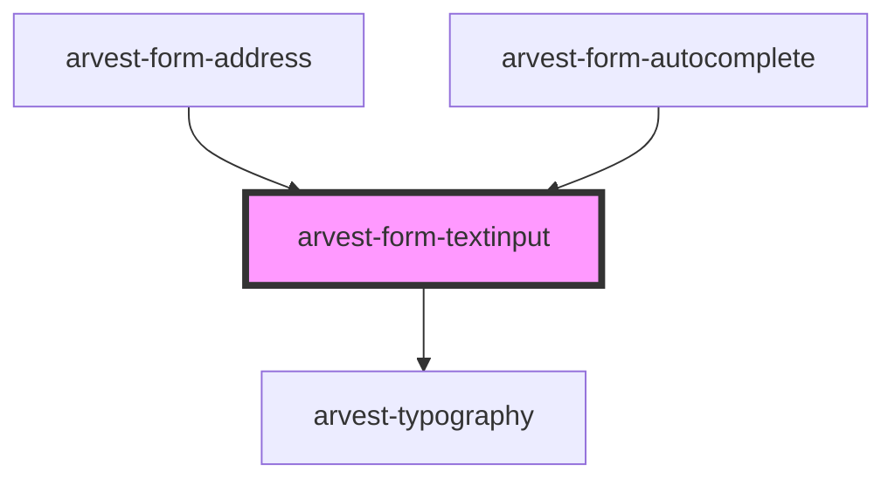

# arvest-form-textinput

<!-- Auto Generated Below -->

## Properties

| Property          | Attribute           | Description                                                                                                                                                                                                                                                                                                                                                      | Type                                                                                                                                      | Default                  |
| ----------------- | ------------------- | ---------------------------------------------------------------------------------------------------------------------------------------------------------------------------------------------------------------------------------------------------------------------------------------------------------------------------------------------------------------- | ----------------------------------------------------------------------------------------------------------------------------------------- | ------------------------ |
| `ariaDescribedBy` | `aria-described-by` | The aria-describedby attribute is used to indicate the IDs of the elements that describe the object. It is used to establish a relationship between widgets or groups and text that described them. More info here: https://developer.mozilla.org/en-US/docs/Web/Accessibility/ARIA/ARIA_Techniques/Using_the_aria-describedby_attribute                         | `string`                                                                                                                                  | `undefined`              |
| `ariaLabel`       | `aria-label`        | The aria-label attribute is used to define a string that labels the current element. Use it in cases where a text label is not visible on the screen. If there is visible text labeling the element, use aria-labelledby instead. More info here: https://developer.mozilla.org/en-US/docs/Web/Accessibility/ARIA/ARIA_Techniques/Using_the_aria-label_attribute | `string`                                                                                                                                  | `undefined`              |
| `ariaRequired`    | `aria-required`     | The aria-required attribute provides assistive technologies information indicating if a field is required or not. [Required]  More info here: https://developer.mozilla.org/en-US/docs/Web/Accessibility/ARIA/ARIA_Techniques/Using_the_aria-required_attribute                                                                                                  | `boolean`                                                                                                                                 | `undefined`              |
| `autocomplete`    | `autocomplete`      | Use autocomplete to improve automated assistance and the use of password managers More info here: https://developer.mozilla.org/en-US/docs/Web/HTML/Attributes/autocomplete                                                                                                                                                                                      | `string`                                                                                                                                  | `'on'`                   |
| `disabled`        | `disabled`          | Is the input element disabled? Defaults to false.                                                                                                                                                                                                                                                                                                                | `boolean`                                                                                                                                 | `false`                  |
| `elemId`          | `elem-id`           | Give the Element a unique ID to match labels with form fields and enable functionality [Required]                                                                                                                                                                                                                                                                | `string`                                                                                                                                  | `undefined`              |
| `error`           | `error`             | Prop for error message.                                                                                                                                                                                                                                                                                                                                          | `string`                                                                                                                                  | `undefined`              |
| `filter`          | --                  | Regex filter for input value. Defaults to filter out special characters and underscores as per Arvest Bad Character List.                                                                                                                                                                                                                                        | `RegExp`                                                                                                                                  | `/[^a-zA-Z\d\s]/giu`     |
| `label`           | `label`             | Label describes the input field for the user and for screenreaders [Required]                                                                                                                                                                                                                                                                                    | `string`                                                                                                                                  | `undefined`              |
| `mask`            | `mask`              | Prop to describe the text mask to be used.                                                                                                                                                                                                                                                                                                                       | `string`                                                                                                                                  | `undefined`              |
| `maxlength`       | `maxlength`         | Maximum number of characters allowed.                                                                                                                                                                                                                                                                                                                            | `number`                                                                                                                                  | `undefined`              |
| `name`            | `name`              |                                                                                                                                                                                                                                                                                                                                                                  | `string`                                                                                                                                  | `undefined`              |
| `placeholder`     | `placeholder`       | Placeholders are optional and have been visually hidden from the component so any text rendered will not have an effect. This prop has been left in the event the design changes in the future.                                                                                                                                                                  | `string`                                                                                                                                  | `undefined`              |
| `required`        | `required`          | Is the input element required? Defaults to false.                                                                                                                                                                                                                                                                                                                | `boolean`                                                                                                                                 | `false`                  |
| `small`           | `small`             |                                                                                                                                                                                                                                                                                                                                                                  | `string`                                                                                                                                  | `undefined`              |
| `type`            | `type`              | Type specifies what type of data should be entered into the field. Options are: email, password, text, and number. [Required]                                                                                                                                                                                                                                    | `FormTextInputType.email \| FormTextInputType.number \| FormTextInputType.password \| FormTextInputType.search \| FormTextInputType.text` | `FormTextInputType.text` |
| `value`           | `value`             | Value of the input.                                                                                                                                                                                                                                                                                                                                              | `string`                                                                                                                                  | `undefined`              |

## Events

| Event        | Description                                                                                                                              | Type                  |
| ------------ | ---------------------------------------------------------------------------------------------------------------------------------------- | --------------------- |
| `textChange` | textChange event tracks the change in text input. It also checks if there is an active filter on the text input and applies that filter. | `CustomEvent<string>` |

## Dependencies

### Used by

 - [arvest-form-address](../arvest-form-address)
 - [arvest-form-autocomplete](../arvest-form-autocomplete)

### Depends on

- [arvest-typography](../arvest-typography)

### Graph

----------------------------------------------

All components ©2021 Arvest. All rights reserved.
