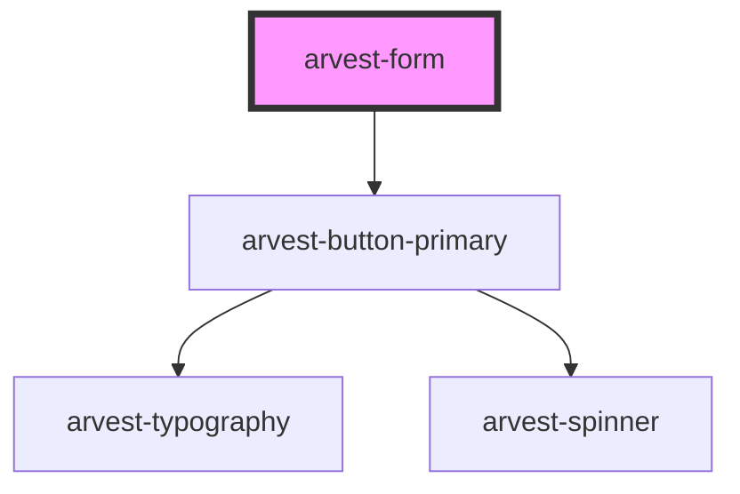

# arvest-form

<!-- Auto Generated Below -->

## Properties

| Property     | Attribute     | Description                                 | Type      | Default     |
| ------------ | ------------- | ------------------------------------------- | --------- | ----------- |
| `action`     | `action`      | Submit URL for action attribute.            | `string`  | `undefined` |
| `buttonText` | `button-text` |                                             | `string`  | `'Submit'`  |
| `inline`     | `inline`      |                                             | `boolean` | `undefined` |
| `method`     | `method`      | Method for action prop ex. "get" or "post". | `string`  | `undefined` |

## Events

| Event        | Description        | Type               |
| ------------ | ------------------ | ------------------ |
| `formSubmit` | Form submit event. | `CustomEvent<any>` |

## Dependencies

### Depends on

- [arvest-button-primary](../arvest-button-primary)

### Graph

----------------------------------------------

All components ©2021 Arvest. All rights reserved.
