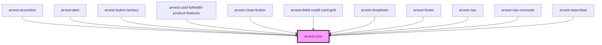

# arvest-icon

<!-- Auto Generated Below -->

## Properties

| Property | Attribute | Description | Type     | Default     |
| -------- | --------- | ----------- | -------- | ----------- |
| `alt`    | `alt`     |             | `string` | `undefined` |
| `icon`   | `icon`    |             | `string` | `undefined` |
| `label`  | `label`   |             | `string` | `undefined` |

## Dependencies

### Used by

 - [arvest-accordion](../arvest-accordion)
 - [arvest-alert](../arvest-alert)
 - [arvest-button-tertiary](../arvest-button-tertiary)
 - [arvest-card-fullwidth-product-features](../arvest-card-fullwidth-product-features)
 - [arvest-close-button](../arvest-close-button)
 - [arvest-debit-credit-card-grid](../arvest-debit-credit-card-grid)
 - [arvest-dropdown](../arvest-dropdown)
 - [arvest-footer](../arvest-footer)
 - [arvest-nav](../arvest-nav)
 - [arvest-nav-microsite](../arvest-nav-microsite)
 - [arvest-searchbar](../arvest-searchbar)

### Graph

----------------------------------------------

All components ©2021 Arvest. All rights reserved.
