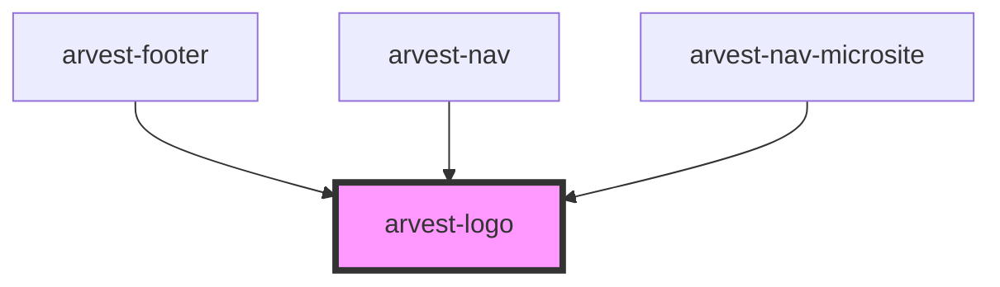

# arvest-logo

<!-- Auto Generated Below -->

## Properties

| Property  | Attribute | Description                                                                                                                                              | Type                                                   | Default                     |
| --------- | --------- | -------------------------------------------------------------------------------------------------------------------------------------------------------- | ------------------------------------------------------ | --------------------------- |
| `url`     | `url`     | Pass in a url as a string for a redirect. This is optional.                                                                                              | `string`                                               | `'https://www.arvest.com/'` |
| `variant` | `variant` | Pass in a variant to change the logo color. Options are white = "white", black = "black", and blue = "blue". This is not required. The default is white. | `LogoColor.black \| LogoColor.blue \| LogoColor.white` | `LogoColor.white`           |

## Dependencies

### Used by

 - [arvest-footer](../arvest-footer)
 - [arvest-nav](../arvest-nav)
 - [arvest-nav-microsite](../arvest-nav-microsite)

### Graph

----------------------------------------------

All components ©2021 Arvest. All rights reserved.
