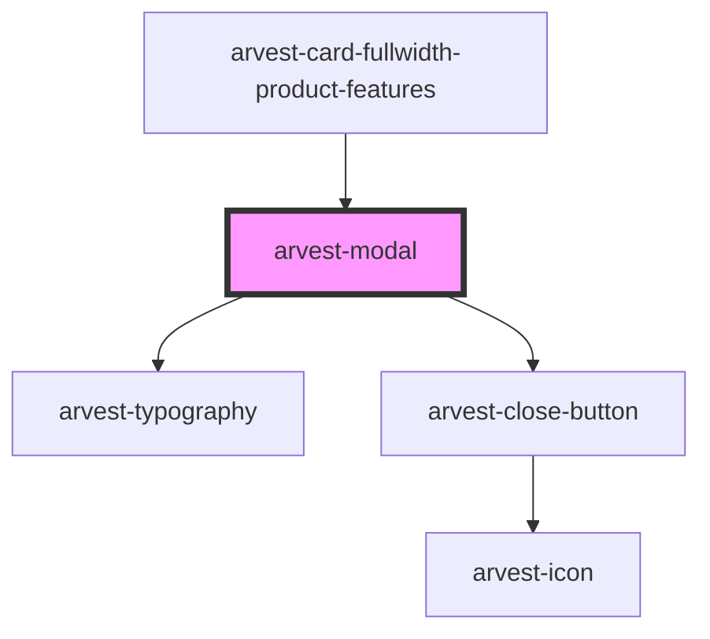

# arvest-modal

<!-- Auto Generated Below -->

## Properties

| Property  | Attribute | Description                      | Type     | Default     |
| --------- | --------- | -------------------------------- | -------- | ----------- |
| `heading` | `heading` | Title at the top of the modal  * | `string` | `undefined` |
| `size`    | `size`    | Modal size (small, large) *      | `string` | `undefined` |

## Events

| Event        | Description                                                  | Type                      |
| ------------ | ------------------------------------------------------------ | ------------------------- |
| `clickClose` | Event emitted when the close button on the modal is clicked. | `CustomEvent<MouseEvent>` |

## Dependencies

### Used by

 - [arvest-card-fullwidth-product-features](../arvest-card-fullwidth-product-features)

### Depends on

- [arvest-typography](../arvest-typography)
- [arvest-close-button](../arvest-close-button)

### Graph

----------------------------------------------

All components ©2021 Arvest. All rights reserved.
