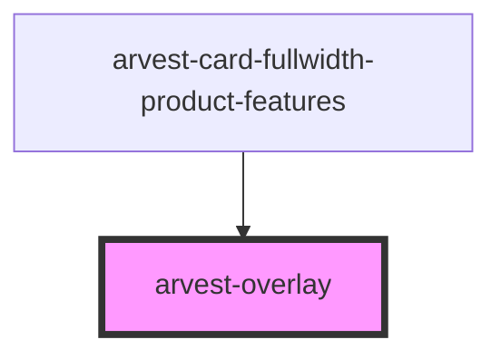

# arvest-overlay

<!-- Auto Generated Below -->

## Properties

| Property   | Attribute  | Description                                                                    | Type      | Default     |
| ---------- | ---------- | ------------------------------------------------------------------------------ | --------- | ----------- |
| `noscroll` | `noscroll` | If true, scrolling underneath the overlay is prevented.                        | `boolean` | `undefined` |
| `visible`  | `visible`  | Set true to open the overlay and display contents. Set false to close overlay. | `boolean` | `undefined` |

## Events

| Event           | Description                               | Type                |
| --------------- | ----------------------------------------- | ------------------- |
| `overlayClosed` | Event emitted when the overlay is closed. | `CustomEvent<void>` |
| `overlayOpened` | Event emitted when the overlay is opened. | `CustomEvent<void>` |

## Dependencies

### Used by

 - [arvest-card-fullwidth-product-features](../arvest-card-fullwidth-product-features)

### Graph

----------------------------------------------

All components ©2021 Arvest. All rights reserved.
