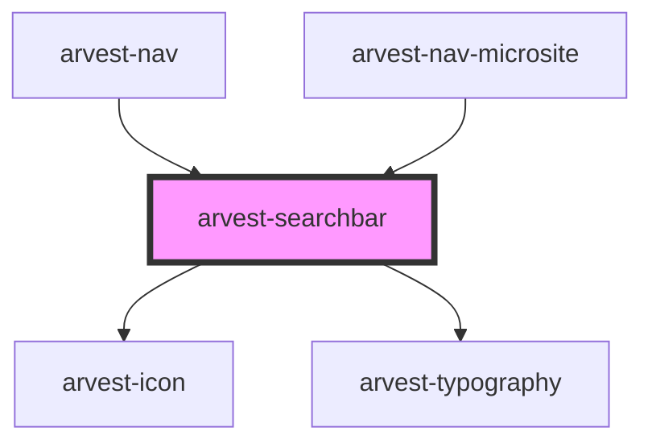

# arvest-searchbar

<!-- Auto Generated Below -->

## Properties

| Property   | Attribute   | Description                    | Type      | Default     |
| ---------- | ----------- | ------------------------------ | --------- | ----------- |
| `isMobile` | `is-mobile` |                                | `boolean` | `false`     |
| `links`    | `links`     | Array of links as json string. | `string`  | `undefined` |

## Events

| Event               | Description                                                                       | Type                  |
| ------------------- | --------------------------------------------------------------------------------- | --------------------- |
| `searchValueChange` | Event emitted when the value entered into search changes. Contains search string. | `CustomEvent<string>` |

## Dependencies

### Used by

 - [arvest-nav](../arvest-nav)
 - [arvest-nav-microsite](../arvest-nav-microsite)

### Depends on

- [arvest-icon](../arvest-icon)
- [arvest-typography](../arvest-typography)

### Graph

----------------------------------------------

All components ©2021 Arvest. All rights reserved.
