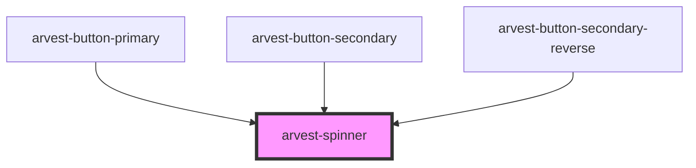

# arvest-spinner

<!-- Auto Generated Below -->

## Properties

| Property    | Attribute   | Description | Type      | Default     |
| ----------- | ----------- | ----------- | --------- | ----------- |
| `isreverse` | `isreverse` |             | `boolean` | `undefined` |

## Dependencies

### Used by

 - [arvest-button-primary](../arvest-button-primary)
 - [arvest-button-secondary](../arvest-button-secondary)
 - [arvest-button-secondary-reverse](../arvest-button-secondary-reverse)

### Graph

----------------------------------------------

All components ©2021 Arvest. All rights reserved.
