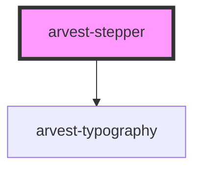

# arvest-stepper

<!-- Auto Generated Below -->

## Properties

| Property     | Attribute     | Description                                                                                    | Type     | Default     |
| ------------ | ------------- | ---------------------------------------------------------------------------------------------- | -------- | ----------- |
| `stepStates` | `step-states` | The step state, in order, comma separated, no spaces, max 5. (active, complete, incomplete)  * | `string` | `undefined` |
| `stepTitles` | `step-titles` | The displayed title for each step, in order, comma separated, no spaces, max 5.  *             | `string` | `undefined` |
| `stepUrls`   | `step-urls`   | The step URL, in order, comma separated, no spaces, max 5.  *                                  | `string` | `undefined` |

## Dependencies

### Depends on

- [arvest-typography](../arvest-typography)

### Graph

----------------------------------------------

All components ©2021 Arvest. All rights reserved.
