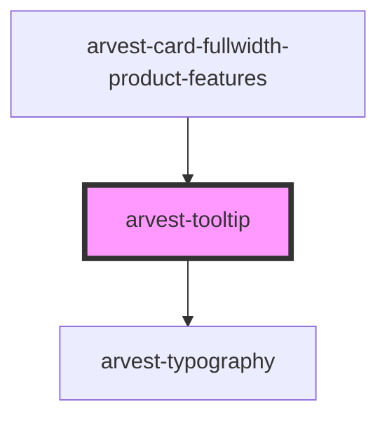

# arvest-tooltip

<!-- Auto Generated Below -->

## Properties

| Property   | Attribute   | Description                                                                                                              | Type                                                                                                                                                                            | Default                     |
| ---------- | ----------- | ------------------------------------------------------------------------------------------------------------------------ | ------------------------------------------------------------------------------------------------------------------------------------------------------------------------------- | --------------------------- |
| `arrow`    | `arrow`     | Show or hide the tooltip arrow.  *                                                                                       | `boolean`                                                                                                                                                                       | `false`                     |
| `ctaTitle` | `cta-title` | CTA title Options:  (button or text) *                                                                                   | `string`                                                                                                                                                                        | `undefined`                 |
| `ctaType`  | `cta-type`  | Type of CTA enabled? Options:  (text, button) *                                                                          | `TooltipCta.button \| TooltipCta.text`                                                                                                                                          | `undefined`                 |
| `ctaUrl`   | `cta-url`   | CTA full URL  *                                                                                                          | `string`                                                                                                                                                                        | `undefined`                 |
| `message`  | `message`   | Tooltip body copy/message (no limit)                                                                                     | `string`                                                                                                                                                                        | `undefined`                 |
| `position` | `position`  | Set the position of the tooltip. Options:  (top-left, top-center, top-right, bottom-left, bottom-center, bottom-right) * | `TooltipPosition.bottomCenter \| TooltipPosition.bottomLeft \| TooltipPosition.bottomRight \| TooltipPosition.topCenter \| TooltipPosition.topLeft \| TooltipPosition.topRight` | `TooltipPosition.topCenter` |
| `trigger`  | `trigger`   | Show or hide the tooltip arrow.  *                                                                                       | `TooltipTrigger.click \| TooltipTrigger.hover`                                                                                                                                  | `TooltipTrigger.hover`      |

## Dependencies

### Used by

 - [arvest-card-fullwidth-product-features](../arvest-card-fullwidth-product-features)

### Depends on

- [arvest-typography](../arvest-typography)

### Graph

----------------------------------------------

All components ©2021 Arvest. All rights reserved.
